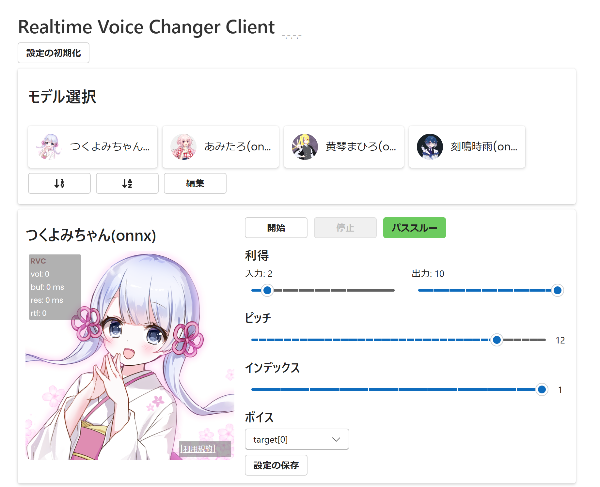

# VCClient designed with Fluent UI
Fluent UI でクライアントの UI を再設計した VCClient の改変版です。

Windows 11 で使用を確認しています。



このプロジェクトは、https://github.com/w-okada/voice-changer をフォークしたもので、MITライセンスに従っています。

## 別途ソフトウェアの動作に必要なもの (依存ソフトウェア)
Windows 版をインストールしてください。

### NVIDIA CUDA Toolkit 12.4
以下より、Windows (x86_64、11、exe) 版をダウンロードし、インストールしてください。

https://developer.nvidia.com/cuda-12-4-0-download-archive

### Python (Pyenv) 3.10
以下のコマンドを端末 (Powershell) で実行し、Pyenv をインストールしてください。

```ps1
Invoke-WebRequest -UseBasicParsing -Uri "https://raw.githubusercontent.com/pyenv-win/pyenv-win/master/pyenv-win/install-pyenv-win.ps1" -OutFile "./install-pyenv-win.ps1"; &"./install-pyenv-win.ps1"
```

Pyenv のインストール後、端末を再起動してください。

以下のコマンドを実行し、Pyenv で Python 3.10 をインストールし、既定の Python として 3.10 を設定してください。

```ps1
pyenv install 3.10
pyenv global 3.10
```

参考: https://github.com/pyenv-win/pyenv-win?tab=readme-ov-file#quick-start

### Poetry
以下のコマンドを実行し、poetry をインストールしてください。

```ps1
pip install poetry
```

## 利用規約
リアルタイムボイスチェンジャーの利用に関しては、各モデルおよび各キャラクターの規約に従ってください。

## 免責事項
本ソフトウェアの使用または使用不能により生じたあらゆる直接損害・間接損害・波及的損害・結果的損害または特別損害について、一切の責任を負いません。